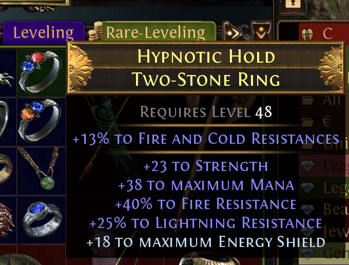
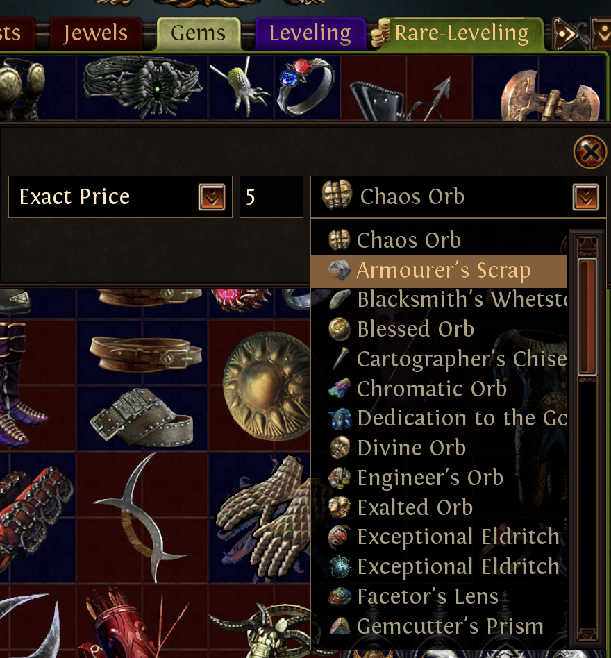
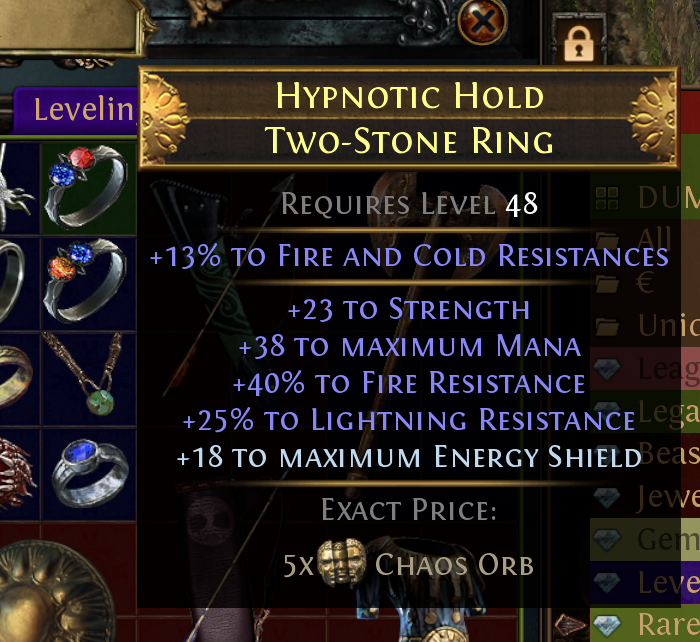
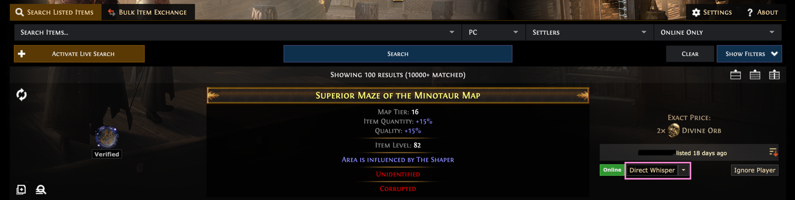

Data Aggregation And Parsing
============================

!> complete me

Path of Exile's Trading System
------------------------------

### Listing an Item

In order to trade items with other, a player can list its items using a in-game feature called `public stash tab`. Each player has on it's account a stash/chest which can be used to store items, a stash is composed of multiple tabs. Some of them could be marked as public and as soon it's the case the tab's content will be listed on the market. To put a price on an item the player will have to right-click on an object and put a note on it asking for anything he wants in exchange for the given item.


*Not priced item in public stash tab*


*Give a price to an item*


*Priced item in public stash tab*

### Searching for listed items

The `market` is mainly accessed by PoE's player through the [Path of Exile Trade Website](https://www.pathofexile.com/trade) where they have access to complete form to find what they need. When it's the case and they want to buy something, they use the in-game chat system with an autogenerated message to start a transaction.



### Public Stashes API

These data are coming from an API developed and exposed by Grinding Gear Games : [Public Stashes API](https://www.pathofexile.com/developer/docs/reference#publicstashes) it's publicly available but need specific authorization to have access to it. 

Here is an extract of answer for one call to this API :

```json
    {
        "next_change_id": "2484186886-2461856592-2386462237-2643539049-2572525706",
        "stashes": [
            {
                {
                    "id": "5599055e6eeffd375d0022e5f87e9f2482f8c33e32efd615ea26e3bb33c15911",
                    "public": true,
                    "stash": "Sell",
                    "items": [
                        {
                            "league": "Necropolis",
                            "id": "5748bbce06439f3c6ababa71e7464d44b2131999df474b2bbfbae57f6fcfb37d",
                            "name": "Damnation Snare",
                            "baseType": "Stygian Vise",
                            // other properties
                        }
                    ]
                }
            }
        ]
    }
```

### Path of Exile Currencies

Player can put whatever they want when asking for trade, but as any market, [currencies](https://www.poewiki.net/wiki/Currency) exist in Path of Exile ecosystem so generally player will ask for a certain amount of currency in exchange for their items.

Not all currencies have the same value meaning there's [exchange rates](https://poe.ninja/economy/settlers/currency) between different currencies knowing that the reference currency when taling about PoE trading is `Chaos Orb`.

crawler-of-exile
----------------

> Responsibilities : Consuming Public Stashes API and persisting the result in JSON files.
> [Sources](https://github.com/PricerOfExile/crawler-of-exile)

This pretty simple project is build with [Node.js](https://nodejs.org/en) and [Express](http://expressjs.com/). The Public Stashes API implements a paging system where you cannot know in advance the next page identifier, so the project has sequential calls to the API with a rate limit of 2 calls/minute as imposed by Grinding Gear Games.

parser-of-exile
----------------

> Responsibilities : List all possible statistics on an item, translate one textual description into one or multiple statistics, convert all prices into a common currency. 
